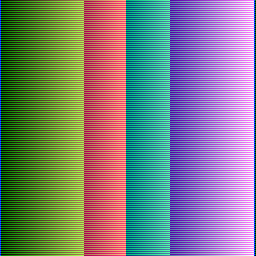

# squiggle

`squiggle` is DSL to describe visual patterns and was created as an entry for `langjam002`

The main idea of `squiggle` is inspired by how image was drawed in old `crt` television.
`squiggle` describes `n` different `squiggles` which can draw on the same canvas, but are not restricted to simple `left to right` as in `crt` beam.

## example

```
300 300             § sets canvas width and height
blending: additive  § sets blending mode for beams when applying to canvas. one of: additivive, subtractive, multiply

s1{                 § describes squiggle - a register based machine (r,g,b) which moves through the canvas and colors the pixels
[+(2)]              § encodes what to do on single step. if you have only one [] then it will execute same set of instructions after each move. 
}                   § this squiggle will add 2 to each r g b component and draw the combined rgb value to canvas

s2{
[+(-2, -2, 1)] [+(2, 1, -3)]  § this squiggle will alternate between applying (-2, -2, 1) to rgb vector and (2, 1, -3)
}
```

which should yield following image:

